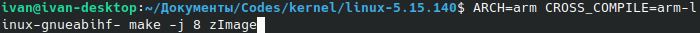

# Урок 49: Сборка ядра
##### Задача: собрать ядро Linux под архитектуру arm и загрузить в эмулятор qemu
###### Шаги выполнения:
1. Установил всё необходимое через пакетный менеджер: кросс-компилятор arm-linux-gnueabihf- и эмулятор qemu-system-arm.
2. Скачал ядро 5.15.140 LTS с kernel.org
3. На всякий случай очистил файлы конфигурации(их там не оказалось)

    

4. Запустил процесс генерирования файла конфигурации.

    

    Однако, операция остановилась:

    

    Установил flex с помощью пакетного менеджера: 

    

    и файл сгенерировался успешно.

    

5. Начал процесс сборки ядра.

    

    Через несколько секунд сборка была остановлена:

    

    Исправляю.

    

    Через несколько минут сборка успешно завершилась.

    

    Проверяю:

    

6. Для запуска не хватает файла древа устройств. Компилирую:

    

7. Можно запускать:

    

    Ожидаемо, из-за отсутствия файловой системы, ядро прерывает загрузку на финальном этапе:
    
    

Цель выполнена.
