# Урок 54: Модули ядра
##### Задача: Повторить модуль ядра с файлом символьного устройства из лекции.
###### Шаги выполнения:
1. Написал исходный код и Makefile.
2. Скомпилировал

    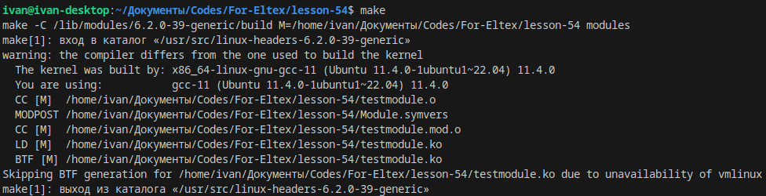

3. Загрузил модуль в ядро

    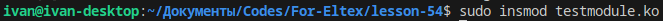

4. Проверил

    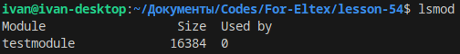

5. Посмотрел выделенный системой мажорный номер

    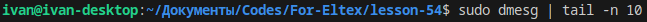

    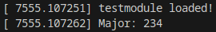

6. Создаю файл символьного устройства в соответствии с полученным мажорным номером

    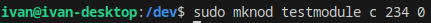

7. Проверяю работу модуля ядра. Пытаюсь прочитать содержимое буфера с помощью cat

    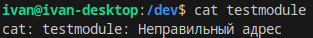
    
8. Трачу много времени на перепроверку, пересборку, поиски ошибки. Не нахожу решения. Пробую другую программу для просмотра содержимого файла

    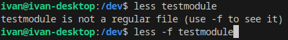

    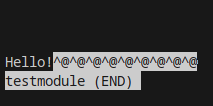

9. Пробую записать данные

    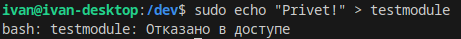

10. Меняю права, чтобы всё-таки записать данные

    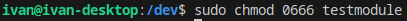

11. Проверяю.

    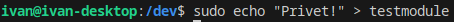

    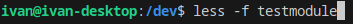

    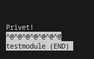

Поставленная задача выполнена.
